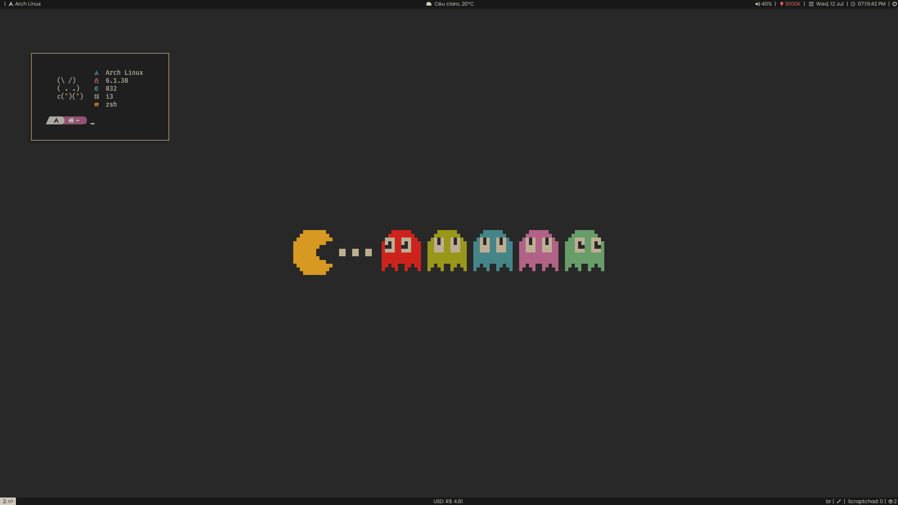
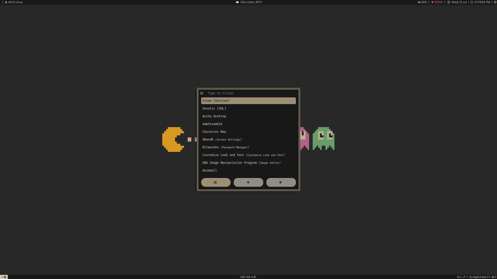
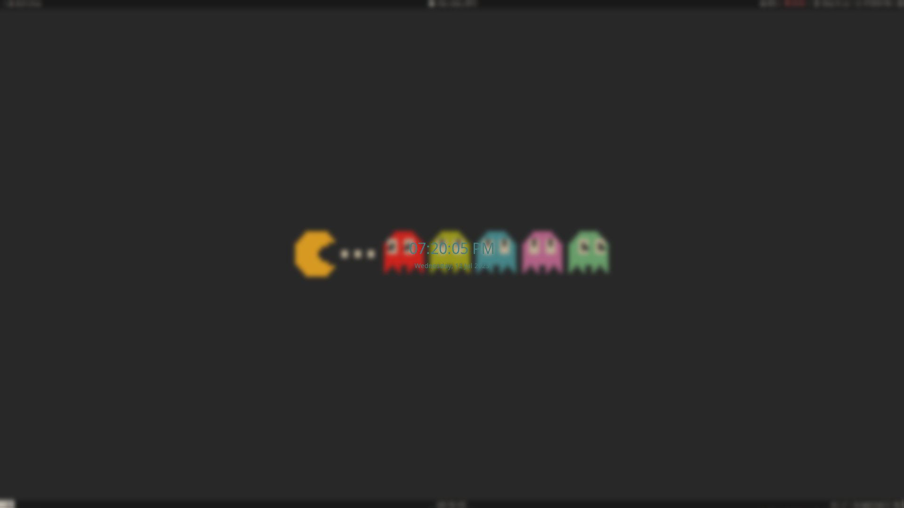

# ***`CURRENT SETUP:`***
| Tipos               | Softwares                                                                                                                           |
| :------------------ | :---------------------------------------------------------------------------------------------------------------------------------- |
| Linux distribution        | [Arch Linux](https://wiki.archlinux.org/title/Arch_Linux_(Portugu%C3%AAs))                                                                                            |                                                                                       
| Window Manager  | [i3](https://github.com/Airblader/i3)                                                                                             
| Browser           | [Qutebrowser](https://qutebrowser.org/)                                                                                |
| Program Launcher | [Rofi](https://github.com/davatorium/rofi)                                                                                         |           
| Status Bar     | [Polybar](https://github.com/polybar/polybar)                                                                                         |                                          |                                                                   
| Vídeo Player        | [MPV](https://mpv.io/)                                                          |
| Music Player | [CMUS](https://cmus.github.io/)                                                     |
| Image viewer | [sxiv](https://github.com/xyb3rt/sxiv)                                                                                                                                                                                             
| Print Screen     | [shotgun](https://github.com/frannks/mydots/blob/main/bin/screenshot)                                                                               |
| Screen Recorder    | [Simple Screen Recorder](https://www.maartenbaert.be/simplescreenrecorder/)                                                                                                    
| Terminal Emulator   | [Kitty](https://github.com/kovidgoyal/kitty)                                                                                 |
| Shell               | [ZSH](https://wiki.archlinux.org/index.php/Zsh)                                                                                                         
| Text editor     | [NeoVim](https://github.com/neovim/neovim)                                                                                  |
| Monitor configuration    | [xrandr](https://www.x.org/releases/X11R7.6/doc/man/man1/xrandr.1.xhtml)                                                                               |
| Lockscreen    | [i3Lock](https://github.com/ffraanks/dotfiles/blob/master/bin/lockscreen)                                                                                                  
| Notification Daemon   | [Dunst](https://github.com/dunst-project/dunst)                                                                                    
| Development   | [NeoVim](https://github.com/neovim/neovim)

# i3 Gaps

# Rofi

# i3-Lock

# Interesses

- [Telegram](https://t.me/FranklinTech)

- [Email](mailto:fraank@riseup.net)

- [i3-install](https://github.com/frannks/i3-install)
